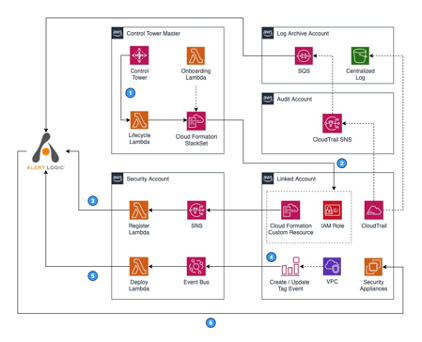

# mdr\_control\_tower\_automation

Alert Logic Managed Detection and Response Integration with AWS Control Tower.

## Overview

AWS Control Tower enables a customer to set up and govern a secure, multi-account AWS environment based on best practices recommended by AWS. 

AWS Control Tower creates the audit and log archive account automatically in addition to the master account. We also recommend that you create a new security account to be used for Alert Logic MDR integration with AWS Control Tower.

AWS Control Tower managed accounts CloudTrail logs are stored in a centralized Amazon S3 bucket located in the Log archive account. The CloudTrail are set to send notification to Amazon SNS topic located in the Audit account. Alert Logic MDR uses Amazon SQS to ingest CloudTrail logs. This solution creates an SQS queue in the Log archive account and subscribes it to the CloudTrail SNS topic in the audit account.

### Supported Protection Modes:

1. Automatic Mode - Alert Logic will create necessary IAM Roles to enable automated deployment of Alert Logic IDS and Scan appliances.
2. Manual Mode - Alert Logic will create necessary IAM Roles to monitor changes via AWS Cloud Trail and discovery APIs, but will not deploy Alert Logic IDS and Scan appliances, instead it will be customer's responsibility. 
```Note that Remediations will be generated in Alert Logic MDR to indicate absence of appliances```
 
### Alert Logic MDR Protection Scope
Depending on your selection during the CloudFormation deployment, Alert Logic MDR will either protect the entire regions or only VPCs that are tagged with specific Tags.

### Architecture Overview

In the solution architecture overview we will use the following terminology:

1. Control Tower Master Account
2. Audit Account - Shared AWS Control Tower account that hosts SNS Topic used to publish account's Cloud Trail notifications
3. Log Archive Account - Shared AWS Control Tower account where Cloud Trail logs are stored.
4. Security Account - An AWS Control Tower managed account that hosts Alert Logic MDR automation Infrastructure (Lambdas and Event Bus)
5. Protected account - An AWS Control Tower account to be protected by Alert Logic MDR.
	


1.	AWS Control Tower published the Lifecycle events after successful enrollment of AWS accounts. The Lifecycle event invokes the AWS Lambda function to deploy the AWS CloudFormation StackSet instance into the new AWS account. 
2.	The StackSet instance creates the required pre-requisite IAM role for Alert Logic MDR. It also sends a notification to an SNS topic located in the security account. 
3.	In the security account, a Lambda function is subscribed to this SNS topic. When this Lambda function runs, it registers the new AWS account into Alert Logic MDR.
4.	When the user updates a VPC by adding or removing an AWS tag with the Alert Logic identifier, this operation generates an event. 
5.	The events are forwarded by the EventBridge rule to the security account where another Lambda function updates the protection scope in Alert Logic MDR platform.
6.	Alert Logic MDR platform automatically scans and deploys the security appliances to the new AWS account based on the registration information and the deployment scope. 


#### Deployment
##### Prerequisites

1. Active subscription to Alert Logic MDR
2. AWS Control Tower deployed and configured.


##### Deployment Process
1. The solution is deployed via creation of AWS CloudFormation Stack using this template <https://s3.amazonaws.com/alertlogic-public-repo.us-east-1/templates/ct-al-master-onboarding.yaml>
2. Information needed by CloudFormation
	* **Alert Logic Account ID**
	* **Valid API Access Key ID and the Secret**
	* **Deployment Mode** - Automatic or Manual
	* **AWS Account ID to deploy Alert Logic's AWS Control Tower Automation to** - AWS Account ID of the designated Security Automation account
	* **Organization Units to protect** - List of OUs to protect
	* **Organization Units to exclude** - All OUs will be protected except the ones listed here
	* **Target Region(s) - List of regions to protect
	* **Protect All VPCs in each region** - If `true`, all VPCs will be protected.
	* **VPC Tags to protect** - VPCs that have any of the Key:Value tags in this list will be protected. ```Note: If a 'Protect All VPCs in each region' option is set to true, this value is ignored.```
	* **Organization ID** - AWS Organization ID for which this automation is being deployed
	* **Log Archive Account ID** - Shared AWS Control Tower account where Cloud Trail logs are stored.
	* **Audit Account ID** - Shared AWS Control Tower account that hosts SNS Topic used to publish account's Cloud Trail notifications
	
	

3. The Stack will:
	* Create all necessary IAM Roles for cross-account integration between Alert Logic MDR AWS Account and accounts selected to be protected by this integration.
	* Set up SQS subscription to AWS Cloud Trail SNS Topic
	* Deploy Alert Logic MDR automation (Lambdas and EventBus) to designated Security Account. This is done via creation of a StackSet and creating an StackSet instance in the designated Security Account.
	* Update Master Account to create new CloudFormation StackSet instance for enrolled account when an account is enrolled to be governed by AWS Control Tower.
	* Create a Master StackSet and deploy it to all protected accounts.
	

```Note: Audit, Log Archive and Security Accounts are always protected by Alert Logic MDR```
